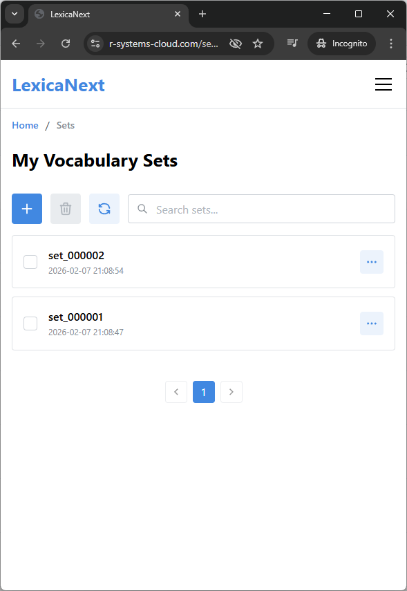
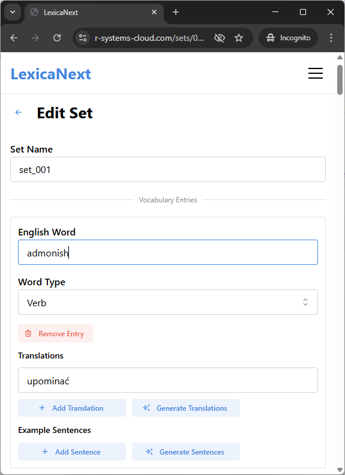
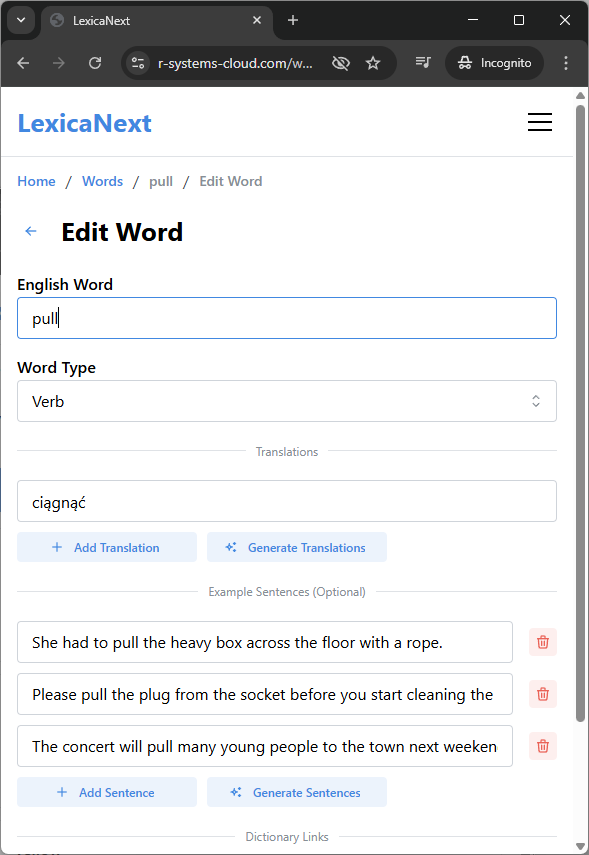
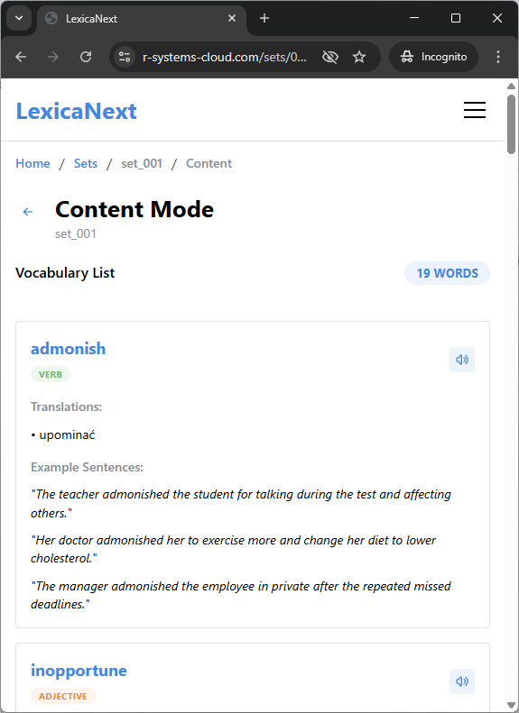
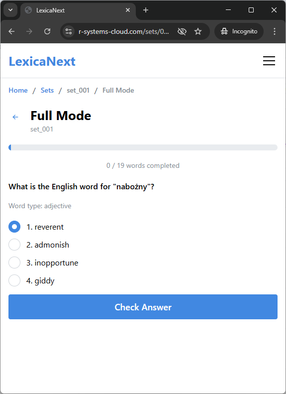
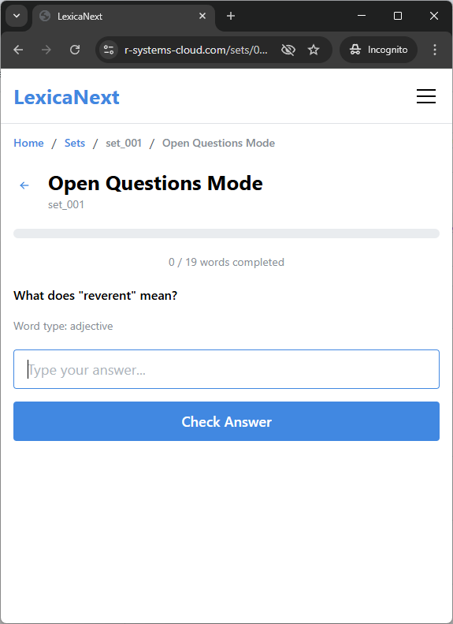

# LexicaNext

A comprehensive English vocabulary learning platform designed to help you master new words through various interactive learning modes.

[](https://dotnet.microsoft.com/)
[](https://reactjs.org/)
[](https://www.typescriptlang.org/)

## Overview

LexicaNext helps you build and expand your English vocabulary through custom word sets and multiple practice modes. Create personalized vocabulary sets with English words, translations, and example sentences, then reinforce your learning with interactive exercises.

## Features

### Vocabulary Set Management

Create and organize your vocabulary sets with:

- English words with grammatical types (noun, verb, adjective, etc.)
- Translations in your native language
- Example sentences for context
- AI-powered translation and sentence generation





### Word Management

Manage words independently of sets. Browse, create, and edit words from a dedicated word list, and associate each word with multiple sets.




### Learning Modes

#### Content Mode

Review and study your vocabulary sets in a structured format. See all words with their translations, grammatical types, and example sentences at a glance.



#### Spelling Mode

Practice pronunciation and spelling by listening to words and typing them correctly.


#### Full Mode

Comprehensive learning with multiple-choice questions. Given a translation, select the correct English word from several options.



#### Open Questions Mode

Advanced practice mode with open-ended questions. Type the meaning of words to test your knowledge retention.



## Technical Documentation

### Tech Stack

#### Frontend

- React 19 with TypeScript
- Vite for build tooling and development
- Mantine UI component library
- TanStack Query for simplifying API calls
- React Router 7 for navigation
- Auth0 for authentication

#### Backend

- ASP.NET Core 10.0
- PostgreSQL database
- Entity Framework Core for data access
- Clean Architecture with CQRS pattern
- FluentValidation for input validation
- OpenAPI/Swagger documentation

### Architecture

The application follows Clean Architecture principles:

- **Domain Layer** (`LexicaNext.Core`) - Business logic and domain models
- **Infrastructure Layer** (`LexicaNext.Infrastructure`) - Data access, auth and external services
- **Presentation Layer** (`LexicaNext.WebApp`) - API endpoints and web hosting
- **Frontend** (`Frontend/lexica-next-front`) - React SPA with TypeScript
- **MCP Server** (`Tools/mcp-server`) - MCP server to interact with the app through Claude Desktop

### Key Patterns

- **CQRS** - Command Query Responsibility Segregation for separating read and write operations
- **Repository Pattern** - Data access abstraction
- **Dependency Injection** - Service registration with Scrutor
- **Type Safety** - Auto-generated TypeScript types from OpenAPI specification

### Getting Started

#### Prerequisites

- [Node.js 24+ and npm](https://nodejs.org/)
- [.NET 10.0 SDK](https://dotnet.microsoft.com/download)
- [PostgreSQL 13+](https://www.postgresql.org/)

#### Backend Setup

1. Create an empty PostgreSQL database.
2. Add a database connection string to user secrets in the following projects:

    - `LexicaNext.WebApp`
    - `LexicaNext.Infrastructure`

   It should look like the following:

    ```json
    {
      "ConnectionStrings": {
         "AppPostgresDb": "Server=<server>;Port=<port>;Database=<database_name>;User Id=<user_id>;Password=<user_password>"
      }
    }
    ```

3. Add other secrets to user secrets in `LexicaNext.WebApp` project:

    - Storage configuration
    - Auth0 configuration
    - Microsoft Foundry configuration

4. Apply EF Core migration:

    ```powershell
   cd LexicaNext.Infrastructure
   dotnet ef database update
    ```

5. Run backend solution.

#### Frontend Setup

1. **Install Dependencies**

    ```powershell
    cd Frontend/lexica-next-front
    npm install
    ```

2. **Environment Configuration**

   Create environment files in `Frontend/lexica-next-front/env-config/`:

    - `.env.local` for development
    - Configure Auth0 credentials and API endpoints

3. **Run Frontend**

    ```powershell
    npm run dev
    ```

### Development Commands

#### Frontend

```powershell
cd Frontend/lexica-next-front

# Development server
npm run dev

# Build for production
npm run build

# Lint code
npm run lint

# Format code
npm run prettier
```

#### Backend

```powershell
# Build solution
dotnet build LexicaNext.sln

# Run web application
dotnet run --project LexicaNext.WebApp

# Run CLI commands
dotnet run --project LexicaNext.CLI
```

#### Database Management

```powershell
cd LexicaNext.Infrastructure

# Create migration
dotnet ef migrations add <migration_name> -o Db\Migrations

# Apply migrations
dotnet ef database update
```

### Docker Deployment

```powershell
docker compose -f ./compose.yaml -p lexica-next up --build
```

### API Documentation

When running the application locally, the OpenAPI specification is available at:

- Spec: <https://localhost:7226/openapi/v1.json>
- Swagger UI: <https://localhost:7226/swagger>

### MCP Server

A Model Context Protocol (MCP) server that enables Claude to interact with the LexicaNext API. Provides tools for vocabulary set management operations.

```powershell
cd Tools/mcp-server
npm install
npm run build
```

Available MCP tools:

- `get_lexica_status` - Check API status
- `get_lexica_sets` - Retrieve vocabulary sets
- `get_lexica_set` - Get specific set by ID
- `create_lexica_set` - Create new vocabulary set
- `update_lexica_set` - Update existing set

## License

This project is licensed under the MIT License.
